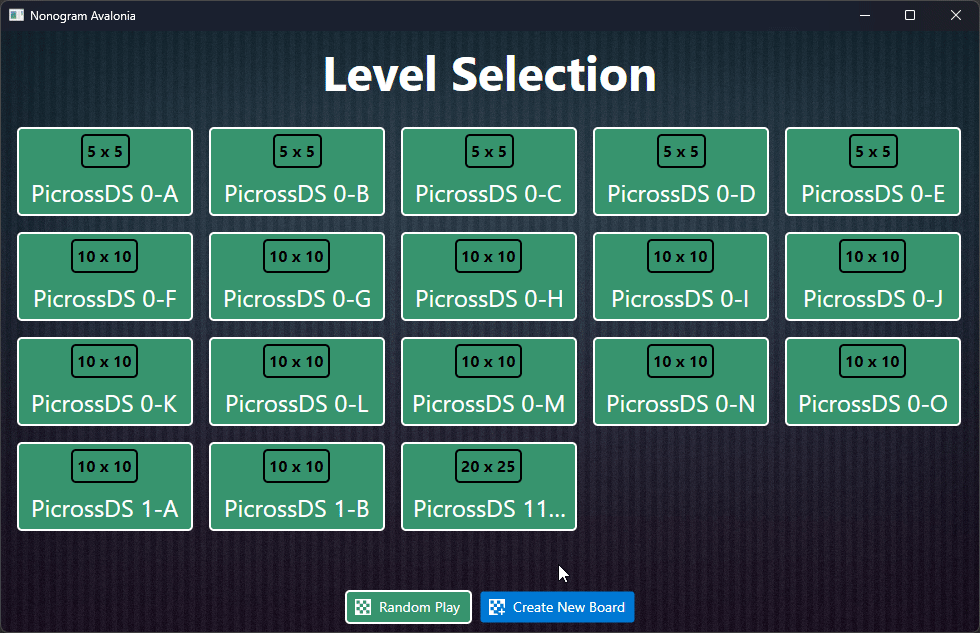

Nonogram puzzle game made using C# and Avalonia. Created primarily for demonstration purposes.

## Features

### Play Premade Puzzles

### Create Puzzles

### Random Puzzle Generation and Solver

* Puzzle Solver

## Keys
* Escape - Back to Menu
* S - Solve Puzzle
* T - Change Theme
* Z - Undo
* Y or R - Redo
